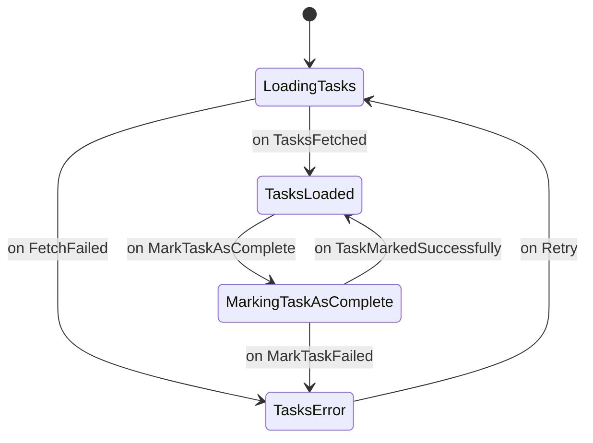

# DESIGN.md

## 1. Overview

Habit Heroes is a gamified family habit-tracking Flutter application designed to run on mobile, and web platforms. It empowers parents to create and manage tasks for their children, who can then complete these tasks to earn points and redeem rewards. The app aims to instill positive habits and responsibility in a fun and engaging way.

This document outlines the technical design and architecture for the Habit Heroes application, following the established project conventions.

## 2. Problem Analysis

The core problem is to create a system where parents can effectively assign and track household chores or educational tasks, and children are motivated to complete them.

### User Stories

#### Parent Module

*   **As a parent, I want to...**
    *   ...sign up and log in to my account securely.
    *   ...create tasks with a title, description, daily/weekly repetition, specific days of the week, and a point value.
    *   ...view a list of all created tasks.
    *   ...edit or delete existing tasks.
    *   ...create custom rewards with a name and a point cost.
    *   ...view a list of all created rewards.
    *   ...edit or delete existing rewards.
    *   ...see a dashboard of my children's progress, including completed tasks and earned points.
    *   ...receive a notification when a child redeems a reward.

#### Kids Module

*   **As a child, I want to...**
    *   ...log in to my account with a simple, kid-friendly interface.
    *   ...see a list of my tasks for the current day, categorized by morning, afternoon, and evening.
    *   ...mark a task as completed to earn points.
    *   ...see my total points update immediately after completing a task.
    *   ...view a list of available rewards and their point costs.
    *   ...redeem my points for a reward when I have enough.
    *   ...have a fun and visually engaging experience.

## 3. Alternatives Considered

The project template has already made several key technology choices. This section briefly documents them and their alternatives.

*   **State Management:** The project uses `flutter_bloc`. This is an excellent choice for its event-driven nature, which promotes a clear separation of concerns and improves testability and debugging. Alternatives like `Riverpod` or `Provider` are also popular but do not enforce the same level of event-driven architecture.
*   **Navigation:** The project uses `auto_route` for declarative routing. It is favored for its code generation capabilities and good integration with `bloc`. An alternative is `go_router`, which is also a powerful choice, but the current project has standardized on `auto_route`.
*   **Backend:** The project uses `Supabase`, a flexible open-source Firebase alternative. It provides authentication, a real-time database, and edge functions. `Firebase` would be the primary alternative, but `Supabase` offers a solid, SQL-based foundation which can be beneficial for complex queries.
*   **UI Components:** The project uses `forui.dev`, which provides a set of beautifully designed and customizable widgets, accelerating UI development.

## 4. Detailed Design

### Data Models

All models will be `Equatable` for easy comparison in Blocs and will use `json_serializable` for data transfer with Supabase.

*   **`AppUser`**:
    *   `id`: `String` (from Supabase Auth)
    *   `email`: `String`
    *   `name`: `String`
    *   `role`: `UserRole` (enum: `parent`, `kid`)
    *   `familyId`: `String`

*   **`Task`**:
    *   `id`: `String` (UUID)
    *   `familyId`: `String`
    *   `title`: `String`
    *   `description`: `String?`
    *   `points`: `int`
    *   `timeOfDay`: `TimeOfDayCategory` (enum: `morning`, `afternoon`, `evening`)
    *   `repeat`: `Repetition` (enum: `daily`, `weekly`)
    *   `daysOfWeek`: `List<int>` (1-7 for Monday-Sunday)
    *   `createdAt`: `DateTime`

*   **`Reward`**:
    *   `id`: `String` (UUID)
    *   `familyId`: `String`
    *   `name`: `String`
    *   `points`: `int`
    *   `createdAt`: `DateTime`

*   **`TaskCompletion`**:
    *   `id`: `String` (UUID)
    *   `taskId`: `String`
    *   `kidId`: `String`
    *   `completedAt`: `DateTime`

### Architecture

We will adhere to the "inside" vs. "outside" separation of concerns documented in the project.

#### Outside Layer (`app/lib/outside`)

This layer contains the singleton providers that interact with external services.

*   **Repositories:** These will be the primary interface for data operations, injected into the `appBuilder`. They will interact with the `SupabaseClient`.
    *   `Auth_Repository`: Handles user authentication (sign-up, sign-in, sign-out, session management).
    *   `Tasks_Repository`: Manages CRUD operations for `Task` objects in the Supabase database.
    *   `Rewards_Repository`: Manages CRUD operations for `Reward` objects.
    *   `Completions_Repository`: Manages the creation and retrieval of `TaskCompletion` records.
    *   `Family_Repository`: Manages family data, linking parents and kids.

#### Inside Layer (`app/lib/inside`)

This layer contains the UI and the state management logic.

*   **Blocs:** These manage the application state and respond to UI events.
    *   `Auth_Bloc`: Manages authentication state (`authenticated`, `unauthenticated`).
    *   `ParentTasks_Bloc`: Manages the state for the parent's task list (loading, displaying, editing tasks).
    *   `ParentRewards_Bloc`: Manages the state for the parent's reward list.
    *   `KidTasks_Bloc`: Manages the state for the child's task list, including marking tasks as complete.
    *   `KidProfile_Bloc`: Manages the child's profile information, including their total points.

*   **Routes (`auto_route`):**
    *   `/`: `SplashScreen` (checks auth state and redirects).
    *   `/login`: `LoginScreen`.
    *   `/signup`: `SignUpScreen`.
    *   `/parent`: `ParentDashboardScreen` (using a `BottomNavigationBar` or similar for tabs).
        *   `/parent/tasks`: `ParentTasksScreen`.
        *   `/parent/rewards`: `ParentRewardsScreen`.
        *   `/parent/profile`: `ParentProfileScreen`.
    *   `/kid`: `KidDashboardScreen`.
        *   `/kid/tasks`: `KidTasksScreen`.
        *   `/kid/rewards`: `KidRewardsScreen`.
        *   `/kid/profile`: `KidProfileScreen`.
    *   `/tasks/new`: `TaskFormScreen` (for creating/editing tasks).
    *   `/rewards/new`: `RewardFormScreen` (for creating/editing rewards).

### Diagrams (Mermaid)

#### High-Level Component Diagram

```mermaid
graph TD
    subgraph UI
        direction LR
        ParentDashboardScreen --> ParentTasks_Bloc;
        ParentDashboardScreen --> ParentRewards_Bloc;
        KidDashboardScreen --> KidTasks_Bloc;
        KidDashboardScreen --> KidProfile_Bloc;
    end

    subgraph "State Management (Blocs)"
        direction LR
        ParentTasks_Bloc --> Tasks_Repository;
        ParentRewards_Bloc --> Rewards_Repository;
        KidTasks_Bloc --> Tasks_Repository;
        KidTasks_Bloc --> Completions_Repository;
        KidProfile_Bloc --> Family_Repository;
    end

    subgraph "Data Layer (Repositories)"
        direction LR
        Tasks_Repository --> Supabase;
        Rewards_Repository --> Supabase;
        Completions_Repository --> Supabase;
        Family_Repository --> Supabase;
        Auth_Repository --> Supabase;
    end

    UI -- "Events" --> "State Management (Blocs)";
    "State Management (Blocs)" -- "Data" --> UI;
    "State Management (Blocs)" -- "Calls" --> "Data Layer (Repositories)";
    "Data Layer (Repositories)" -- "Data" --> "State Management (Blocs)";
```

#### State Diagram for `KidTasks_Bloc`



## 5. Summary

The design leverages the existing project structure, using `flutter_bloc` for state management and `auto_route` for navigation, all backed by `Supabase`. The clear separation between the "inside" and "outside" layers will ensure the application is testable and maintainable. The feature set is divided logically between Parent and Kid modules, with a data model that supports the required functionality.

## 6. References

*   [Gamification Best Practices](https://www.google.com/search?q=best+practices+for+gamification+in+mobile+apps+for+kids+and+families)
*   [flutter_bloc Documentation](https://bloclibrary.dev/)
*   [auto_route Documentation](https://pub.dev/packages/auto_route)
*   [Supabase Flutter Tutorial](https://supabase.com/docs/guides/getting-started/tutorials/with-flutter?queryGroups=database-method&database-method=sql)
*   Project's `docs/` directory.
